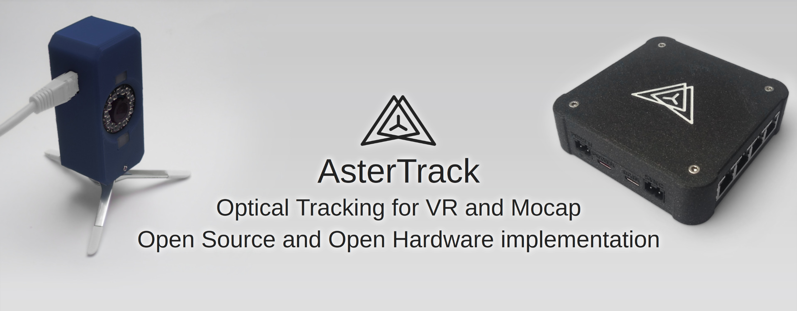

# AsterTrack

AsterTrack is a custom multi-camera system designed to track markers and targets in 3D space for a variety of purposes like virtual reality and motion capture.
This so-called optical tracking is commonly used in professional studios, but typically costs several thousands of euros for even the most basic setups.  
AsterTrack implements the same concept with much less expensive hardware, and pioneer a user-friendly multi-camera tracking experience.  
It aims to be as accurate as the best consumer VR tracking systems, with similarly low latency, while being very affordable for what it does.  
The trackers can be passive (that is, without battery) and are thus very cheap and lightweight.
Users can even create and calibrate trackers themselves from 3D prints or existing objects.

## Current State

AsterTrack is in a functional state, but usability varies depending on your exact use case. Here are the states of some of the major components:   
**Camera Calibration:** Fully functional and easy to use - may need improvements for multi-room setups.  
**Target Calibration:** New Targets can be calibrated just fine, but it is a slow, compute-intensive process that requires some manual involvement still. However, this is only needed once for each new target.  
**Target Tracking:** Unassisted target tracking is complete and working almost at the peak of what's reasonably possible. IMU-assisted target tracking is very much still a WIP, with only raw gyroscope samples being automatically calibrated and used for tracking prediction (missing accelerometer and fused orientation measurements).   
**Integrations:** A VRPN integration exists to send tracker data to other custom applications, but no official VR driver exists yet, nor any file formats used for mocap. A Monado driver is being worked on, and a SteamVR driver is planned.

## Building Guides

Many more details can be found in the dedicated [building documentation](building.md).  
The software is cross-platform (Windows and Linux), though at the current stage has much better support on Linux (both for building and using).  
You need at least 3 AsterTrack Cameras and one AsterTrack Controller for a minimal setup. You can add more cameras and even controllers at any point, with each controller supporting up to 8 cameras.  
You will need mounting hardware for each camera - details of your options can be found in the dedicated [mounting documentation](mounting.md), and tips for room setup in the [room setup documentation](room_setup.md).  
Additionally, you will need a USB PD power source or another power supply that can output between 12V to 24V. 10W should be sufficient for a 3 camera setup, each camera needs about 3W, but please calculate with 5W to be safe.  
Finally, you'll need USB Data and Power cable for each controller, and a CAT 5(e) cable with straight wiring for each camera. These CAT 5 cables are best sourced on your own, they can be found for cheap in a variety of lengths, colors and shapes that you can choose to fit your room. Cheap ones cost about 2€, more expensive ones might cost up to 10€ with smaller, easier to hide wiring (whether round or even flat).
