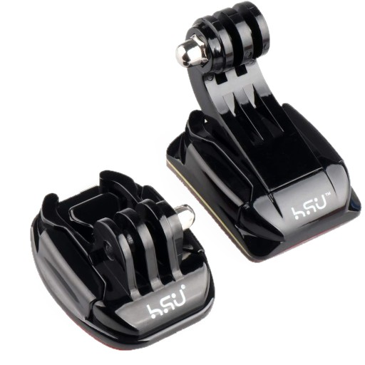
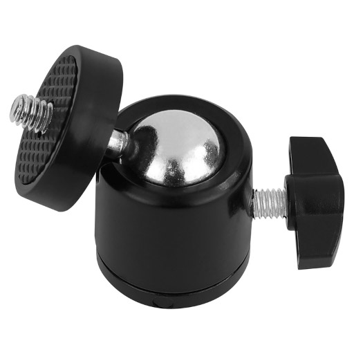
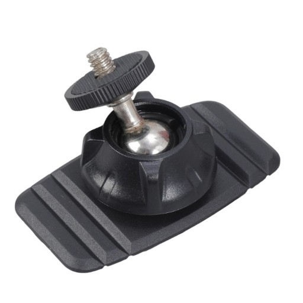

# Mounting Hardware

Cameras can be mounted using any mounting hardware compatible with 1/4" threads, which are common for mounting small cameras.
Tripods for larger cameras may need, for example, 3/8" adapters.  
[One mounting solution](#ball-joint-mount-with-fixing-ring-recommended) has been picked as the default for its ease of installation and low price.
But there are several other ways to mount the hardware that may be more suitable to your setup.

## Mechanism
Relevant qualities:

- Flexibility to accommodate to any viewing angle
	- especially switching aspect ratio (rotating by 90° on the roll axis)
- Ease of use during mounting
- Tolerances and minimal flex once mounted
- Wide availability on many stores, and price

<figure role="group" style="width:100%; display: flex; flex-direction: row">
<figure>
	
	<figcaption>Action Camera Mounting System</figcaption>
</figure>
<figure>
	
	<figcaption>Ball Joint With Single Fixing Screw</figcaption>
</figure>
<figure>
	
	<figcaption>Ball Joint With Fixing Ring (Recommended)</figcaption>
</figure>
</figure>

#### Action Camera Mounting System
Readily available and very flexible in theory.
However, to achieve full flexibility, you may need to combine many parts, leaving three separate tightening methods - the fixing ring to tighten the roll axis, and two hand-screws to tighten the yaw and pitch.  
This has implications for ease of use, flex due to the amount of leverage on a chain of plastic parts, and ironically, price.
While cheap individually, these parts often have to be bought in sets speculatively, making it easy to overbuy.  
Additionally, the typical adhesive/screw mounts have quite a bit of play, adding onto the already quite flexible multi-part assembly of plastic parts, resulting in a setup that might need to constantly improve its own calibration.  
So unless you already have a lot of hardware you don't mind using permanently, or this is the only one you can buy for a reasonable price, it is not recommended to use this mounting system.

#### Ball Joint Mount with Fixing Screw
Ball joints of this design allows for full flexibility in orienting the camera thanks to the notch allowing full 90° angles with a rotating base.
It is widely available on multiple platforms for cheap.
When combined with a 3D-printed 1/4" compatible adhesive mounting plate, this seems to promise a good all-around mounting solution.  
Unfortunately, it is quite cumbersome to use in practice as the mounting screw, by relying on metal-on-metal friction with the ball joint itself, is effectively a binary lock.
That means, you have to constrain the full range of motion while securing the screw, which is challenging to do while mounting.
Anecdotally, it is also easy to overtighten the screw and damage the threads of the CNC shell.  
Based on these findings, we recommend against using this specific mounting mechanism.

#### Ball Joint Mount with Fixing Ring (recommended)
This design of securing the ball joint has many advantages, as it applies force on the ball joint through separate plastic grips.
This means, the force increases gradually as the screw is tightened, allowing for easy adjustments of the camera orientation during the mounting process.
By keeping the turning knob separated from the ball joint, accidental changes to the positioning while tightening can be mostly avoided.  
The only major disadvantage is that the range of adjustment is more limiting, as the ball can only be rotated around 45° off-axis before hitting the fixing ring.
To address this, newer iterations of AsterTrack cameras provide mounting points on all sides except front and back, so that this design gains the full range of motion required.  
Finally, it does not require assembly of multiple optional parts, or 3D printing additional parts, as it is a cheap, but complete package for adhesive mounting.
As such, it is the recommended and default mounting mechanism, and can be bought in multiple places, e.g. <a href="https://aliexpress.com/item/1005009392330701.html">aliexpress</a>.

## Securing
There are several ways to secure mounting hardware.
The requirements for this are rather lax, as the cameras are lightweight and have no moving parts except for the filter switcher, so vibrations from the camera itself are not a concern.
However, the mount should be sufficiently stiff, especially in areas that experience earthquakes, to reduce the chances of a faint earthquake disturbing an existing calibration.  
Generally, the structural and temperature stability of the mounting surfaces, e.g. walls of a building, are important as well, but often out of control of the user.

##### Metal Trusses
Used in professional setups for optimal rigidity and independence from outside influences, these do not rely on attachment to the room directly, but provide their own mounting framework.

##### Screws
While technically the most secure for attaching directly to a wall or ceiling, it is generally unnecessary unless it is straight-forward and largely non-destructive for the construction of your room.  
Unfortunately there is currently no recommended mounting hardware that supports screws, so you might have to get creative with the provided options.

##### Magnetic
Some mounting hardware has magnetic bases buit-in, and may be used in some scenarios, though their mounting security is generally inferior, especially rotationally.
Do make sure the surface you intend to use is actually magnetic and not made of e.g. aluminium.

##### Adhesive (Recommended)
The most approachable and thus recommended method to secure your mounting hardware is using adhesives.  
While technically destructive and potentially problematic in rentals, any resulting surface damage can often be much more easily patched than e.g. screw holes.  
Do make sure the surface of the room provides sufficient stability, otherwise you might have to remove the top layer pro-actively to get to a stable surface.
